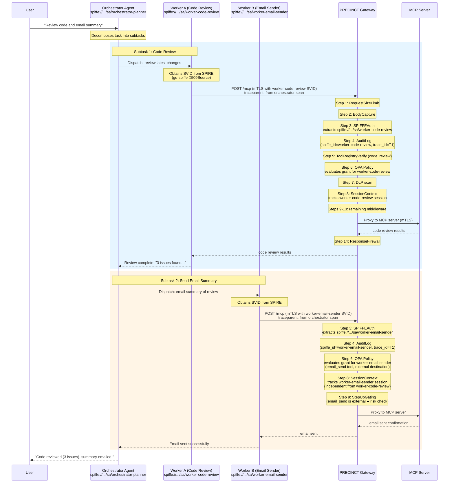

# Multi-Agent Orchestration Security Patterns

This document describes security patterns for multi-agent orchestration scenarios where
an orchestrator agent delegates tool calls to worker agents through the MCP Security
Gateway. It covers SPIFFE identity flow, audit trail attribution, and an assessment of
whether gateway middleware changes are needed.

**Context**: The PRECINCT Gateway (as implemented in `internal/gateway/gateway.go`)
enforces a 13-step middleware chain plus a response firewall on every request. This
document addresses how that enforcement model extends to multi-agent topologies.

---

## 1. Multi-Agent Orchestration Patterns

Three orchestration patterns are relevant for MCP security. Each has different identity
and trust characteristics.

### 1.1 Supervisor Pattern

A single orchestrator agent coordinates multiple worker agents. The orchestrator receives
a high-level task, decomposes it, and dispatches subtasks to specialized workers. Each
worker calls MCP tools through the gateway independently.

**Security characteristics**:
- The orchestrator and each worker have distinct SPIFFE identities
- The orchestrator does not proxy tool calls -- it delegates tasks
- Each worker authenticates to the gateway with its own X.509 SVID
- The gateway evaluates OPA policy independently for each worker's SPIFFE ID

**When to use**: Enterprise workflows where an orchestrator plans and coordinates, but
workers execute tool calls directly. This is the most common pattern for teams using
frameworks like LangGraph, CrewAI, or AutoGen.

### 1.2 Sequential Chain Pattern

Agents execute in sequence, each passing its output as input to the next. Agent A
completes its work, then Agent B begins using A's output as context. Each agent
independently calls MCP tools through the gateway.

**Security characteristics**:
- Each agent in the chain has its own SPIFFE identity
- No delegation relationship -- each agent acts autonomously
- The gateway sees independent requests from distinct identities
- Session context tracks each agent's behavior separately

**When to use**: Pipeline-style workflows (data extraction -> analysis -> report
generation) where each stage is a separate agent with distinct tool permissions.

### 1.3 Proxy (Swarm) Pattern

An orchestrator agent proxies tool calls on behalf of worker agents. The orchestrator
receives tool call requests from workers and forwards them to the gateway using its own
identity. Workers do not communicate with the gateway directly.

**Security characteristics**:
- Only the orchestrator has a SPIFFE identity visible to the gateway
- Workers are internal to the orchestrator's trust boundary
- The gateway cannot distinguish which worker initiated a tool call
- This pattern has the weakest audit attribution

**When to use**: Only when workers cannot obtain their own SPIFFE identities (e.g.,
ephemeral in-process threads, browser-based agents). This pattern should be avoided when
stronger attribution is needed.

### Pattern Comparison

| Aspect | Supervisor | Sequential Chain | Proxy (Swarm) |
|--------|-----------|-----------------|---------------|
| Identity per agent | Yes | Yes | No (shared) |
| Gateway sees each agent | Yes | Yes | No |
| Audit attribution | Strong | Strong | Weak |
| OPA policy granularity | Per-agent | Per-agent | Per-orchestrator only |
| Session isolation | Full | Full | Shared |
| Recommended | Yes | Yes | With caveats |

**Recommendation**: Use the Supervisor or Sequential Chain pattern whenever possible.
The Proxy pattern sacrifices identity granularity and audit attribution for
convenience. If the Proxy pattern is necessary, use the `X-On-Behalf-Of` header
pattern described in Section 3 below.

---

## 2. SPIFFE Identity Flow in Multi-Agent Scenarios

### 2.1 SPIFFE ID Scheme for Multi-Agent Workloads

The existing SPIRE registration entries (see `infra/eks/spire/registration-entries.yaml`)
use the scheme:

```
spiffe://<trust-domain>/ns/<namespace>/sa/<service-account>
```

For multi-agent deployments, extend this scheme to distinguish orchestrators from workers:

```
# Orchestrator agent
spiffe://agentic-ref-arch.poc/ns/agents/sa/orchestrator-planner

# Worker agents (one per specialization)
spiffe://agentic-ref-arch.poc/ns/agents/sa/worker-code-review
spiffe://agentic-ref-arch.poc/ns/agents/sa/worker-data-analysis
spiffe://agentic-ref-arch.poc/ns/agents/sa/worker-email-sender
```

Each worker runs as a separate Kubernetes pod with its own service account. SPIRE issues
distinct X.509 SVIDs to each via the `k8s` workload attestor (namespace + service account
selectors).

For non-Kubernetes deployments (Docker Compose), the `docker` workload attestor can use
container labels to distinguish agents:

```
# Docker Compose SPIRE registration
spiffe://poc.local/agent/orchestrator-planner
spiffe://poc.local/agent/worker-code-review
```

### 2.2 Identity Issuance and Rotation

**Go agents**: Use the `go-spiffe` v2 SDK directly. The `workloadapi.X509Source` handles
SVID issuance, rotation, and trust bundle updates automatically. This is the
production-ready approach proven in the gateway itself (see `EnableSPIFFETLS` in
`internal/gateway/gateway.go`).

```go
// Worker agent SPIFFE identity setup (Go)
source, err := workloadapi.NewX509Source(ctx)
if err != nil {
    log.Fatal("failed to connect to SPIRE: ", err)
}
defer source.Close()

// Use source for mTLS to the gateway
tlsConfig := tlsconfig.MTLSClientConfig(source, source, tlsconfig.AuthorizeAny())
httpClient := &http.Client{Transport: &http.Transport{TLSClientConfig: tlsConfig}}
```

**Non-Go agents (Python, Node.js)**: Use the SVID-to-PEM init container pattern proven
in RFA-8z8.2. An init container fetches the X.509 SVID from the SPIRE Workload API and
writes PEM files to a shared volume. The agent reads these files for mTLS.

```yaml
# Init container pattern for non-Go agents
initContainers:
  - name: svid-init
    image: ghcr.io/spiffe/spiffe-helper:latest
    volumeMounts:
      - name: svid-certs
        mountPath: /certs
    env:
      - name: SPIFFE_ENDPOINT_SOCKET
        value: "unix:///spire-agent-socket/agent.sock"
containers:
  - name: python-agent
    image: my-python-agent:latest
    env:
      - name: SVID_CERT_PATH
        value: "/certs/svid.pem"
      - name: SVID_KEY_PATH
        value: "/certs/svid_key.pem"
      - name: SVID_BUNDLE_PATH
        value: "/certs/bundle.pem"
    volumeMounts:
      - name: svid-certs
        mountPath: /certs
        readOnly: true
```

### 2.3 Session Context Flow

The gateway's `SessionContextMiddleware` (step 8) tracks per-agent session state keyed by
SPIFFE ID + session ID. In the Supervisor pattern:

- The orchestrator's session tracks its planning and coordination actions
- Each worker's session tracks its tool invocations independently
- Exfiltration detection operates per-session: a worker accessing sensitive data and then
  calling an external tool triggers the pattern, regardless of what other agents are doing

**Session isolation is maintained by SPIFFE identity**. The `GetOrCreateSession` function
in `internal/gateway/middleware/session_context.go` uses `(spiffeID, sessionID)` as the
composite key. Two different agents cannot share a session even if they use the same
session ID string, because their SPIFFE IDs differ.

### 2.4 Secret Access (SPIKE Token Flow)

In multi-agent scenarios, SPIKE tokens bind secrets to specific SPIFFE identities via
the `OwnerID` field (see `ValidateTokenOwnership` in
`internal/gateway/middleware/spike_token.go`). This means:

- An orchestrator cannot issue SPIKE tokens that a worker can redeem (the OwnerID
  would not match the worker's SPIFFE ID)
- Each worker must obtain its own SPIKE tokens scoped to its identity
- Token scope (`location.operation.destination`) further constrains which tools and
  destinations a given token can be used with

This is a security feature: it prevents a compromised orchestrator from escalating
privileges by passing its tokens to workers.

---

## 3. Audit Trail Attribution for Delegated Tool Calls

### 3.1 Current Audit Model

The gateway's `AuditLog` middleware (step 4, `internal/gateway/middleware/audit.go`)
records every request with:

- `spiffe_id`: The authenticated identity of the requesting agent
- `session_id`: The session context identifier
- `decision_id`: A unique identifier for the authorization decision
- `trace_id`: The OpenTelemetry trace ID for distributed tracing
- `prev_hash`: SHA-256 of the previous audit event (tamper-evident hash chain)

In the Supervisor and Sequential Chain patterns, each agent's tool calls are attributed
to its own SPIFFE ID. Audit events for different agents are naturally distinguishable.

### 3.2 Correlation via OTel Trace Context

For the Supervisor pattern, the orchestrator and workers can share a trace context to
enable end-to-end tracing of a delegated task:

1. The orchestrator creates a root span for the task
2. When dispatching to a worker, the orchestrator propagates the `traceparent` header
3. The worker includes this `traceparent` when calling the gateway
4. The gateway's `TracingTransport` (see `NewTracingTransport` in gateway.go) propagates
   the trace context to upstream MCP servers

This creates a single distributed trace spanning: orchestrator -> worker -> gateway ->
MCP server. The audit log's `trace_id` field links all events in this trace.

**The OTel Collector exception from mTLS applies here**: telemetry data flows to the
collector without mTLS because it contains only spans and metrics, never secrets.
Multi-agent deployments should maintain this exception to avoid coupling telemetry
infrastructure to SPIRE availability.

### 3.3 The On-Behalf-Of Header (Proxy Pattern Only)

When the Proxy pattern is unavoidable, the orchestrator should declare the originating
worker's identity using an advisory header:

```
X-On-Behalf-Of: spiffe://agentic-ref-arch.poc/ns/agents/sa/worker-code-review
```

**This header is NOT authenticated**. The gateway does not validate it against SPIRE. It
is an audit-only annotation that helps operators correlate tool calls to the logical
agent that requested them. The authenticated identity remains the orchestrator's SPIFFE
ID.

The audit event would record:

```json
{
  "spiffe_id": "spiffe://agentic-ref-arch.poc/ns/agents/sa/orchestrator-planner",
  "on_behalf_of": "spiffe://agentic-ref-arch.poc/ns/agents/sa/worker-code-review",
  "action": "mcp_request",
  "tool": "code_review_tool",
  "trace_id": "abc123..."
}
```

**GDPR note**: SPIFFE IDs are pseudonymous identifiers under GDPR Recital 26. If audit
trails link SPIFFE IDs to natural persons (e.g., an agent acts on behalf of a specific
user), the `on_behalf_of` field creates an additional pseudonymous link. GDPR
right-to-deletion obligations (as implemented in `internal/gateway/middleware/gdpr_delete.go`)
apply to both the primary SPIFFE ID and any `on_behalf_of` identifiers stored in audit
logs or session state.

### 3.4 Attribution Summary by Pattern

| Pattern | Primary Identity | Correlation Mechanism | Attribution Strength |
|---------|-----------------|----------------------|---------------------|
| Supervisor | Worker's SPIFFE ID | OTel trace_id links orchestrator + worker spans | Strong |
| Sequential Chain | Each agent's SPIFFE ID | Shared trace_id across chain stages | Strong |
| Proxy (Swarm) | Orchestrator's SPIFFE ID | `X-On-Behalf-Of` header (unauthenticated) | Weak |

---

## 4. Supervisor Pattern: Detailed Sequence

This section documents the Supervisor pattern end-to-end, including identity, session,
authorization, and audit flow.

### 4.1 Scenario

An orchestrator agent receives a task: "Review the latest code changes and send a summary
email." It delegates:
1. Worker A (code-review) calls the `code_review` tool via the gateway
2. Worker B (email-sender) calls the `email_send` tool via the gateway

### 4.2 Sequence Diagram



### 4.3 Key Observations

1. **Identity isolation**: Worker A and Worker B authenticate independently. The gateway
   never sees the orchestrator's identity for tool calls -- only workers call tools.

2. **Policy granularity**: OPA can grant `code_review` to `worker-code-review` and
   `email_send` to `worker-email-sender`. Neither worker can use the other's tools. The
   orchestrator has no tool grants at all (it only coordinates, never calls tools).

3. **Exfiltration detection**: If Worker A's session accesses sensitive code and Worker B
   sends an email, the exfiltration detector does NOT trigger -- the sessions are
   independent. This is correct behavior: the delegation decision was made by the
   orchestrator, not by a single agent trying to exfiltrate. If a single worker were to
   access sensitive code AND send an email, the detector WOULD trigger.

4. **Trace correlation**: Both worker requests share `trace_id=T1` from the orchestrator's
   span. An operator can query the OTel backend for trace T1 and see the complete task:
   orchestrator planning -> Worker A code review -> Worker B email send.

5. **Audit chain**: The hash-chained audit log contains separate events for each worker's
   request, each with the correct `spiffe_id`. The `trace_id` links them. The
   `prev_hash` chain proves no events were inserted or removed.

---

## 5. Gateway Changes Assessment

### 5.1 What the Current Gateway Already Supports

The current middleware chain handles multi-agent orchestration well for the Supervisor
and Sequential Chain patterns:

| Capability | Current Support | Middleware |
|-----------|----------------|-----------|
| Per-agent identity | Yes (mTLS + SPIFFE) | SPIFFEAuth (step 3) |
| Per-agent authorization | Yes (SPIFFE ID in OPA input) | OPAPolicy (step 6) |
| Per-agent session tracking | Yes (keyed by SPIFFE ID) | SessionContextMiddleware (step 8) |
| Per-agent exfiltration detection | Yes (per-session) | SessionContextMiddleware (step 8) |
| Per-agent rate limiting | Yes (per-SPIFFE-ID token bucket) | RateLimitMiddleware (step 11) |
| Per-agent audit attribution | Yes (spiffe_id in audit event) | AuditLog (step 4) |
| Cross-agent trace correlation | Yes (OTel trace propagation) | TracingTransport |
| Per-agent secret binding | Yes (SPIKE token OwnerID) | TokenSubstitution (step 13) |

**No changes are needed for the Supervisor and Sequential Chain patterns.** The gateway
already enforces per-agent identity, authorization, session tracking, and audit
attribution through the SPIFFE ID that each agent presents independently.

### 5.2 Optional Enhancement: X-On-Behalf-Of Header (Proxy Pattern)

If the Proxy pattern is needed, one optional enhancement would improve audit attribution:

**Change**: Teach the `AuditLog` middleware to read an `X-On-Behalf-Of` header and
include its value in audit events as an unauthenticated annotation.

**Scope**: Approximately 5 lines in `internal/gateway/middleware/audit.go`:

```go
// In AuditLog middleware, after extracting SPIFFE ID:
onBehalfOf := r.Header.Get("X-On-Behalf-Of")
// Include in audit event (unauthenticated -- for correlation only)
```

**This is NOT recommended as a default**: It adds an unauthenticated field that could
be spoofed. It should only be considered if an organization has a legitimate need for
the Proxy pattern and accepts the weaker attribution model.

### 5.3 Optional Enhancement: Delegation Chain Context

For organizations that need provable delegation chains (orchestrator authorized Worker A
to act), a future enhancement could add:

- `X-Delegation-Chain`: A JWT or signed claim listing the delegation path
  (orchestrator -> worker), signed by the orchestrator's SVID
- Verification in the SPIFFEAuth middleware: validate the chain signature against the
  SPIRE trust bundle

This is a significant enhancement (estimated: separate epic) and is NOT needed for the
Supervisor or Sequential Chain patterns where each agent acts with its own identity.

### 5.4 Summary of Recommendations

| Change | Pattern | Priority | Effort |
|--------|---------|----------|--------|
| No gateway changes needed | Supervisor, Sequential Chain | -- | -- |
| `X-On-Behalf-Of` audit annotation | Proxy (if needed) | Low | Small (5 lines) |
| `X-Delegation-Chain` signed claims | Proxy (provable) | Future | Large (new epic) |

**Primary recommendation**: Use the Supervisor pattern. Each agent gets its own SPIFFE
identity, the gateway enforces per-agent policy, and audit attribution is strong. The
current gateway middleware chain requires no modifications.

---

## 6. GDPR Considerations for Multi-Agent Audit Trails

SPIFFE IDs are pseudonymous identifiers under GDPR Recital 26. In multi-agent scenarios:

1. **SPIFFE IDs that map to individual users** (e.g., per-user agent instances) are
   personal data. The right-to-deletion mechanism in
   `internal/gateway/middleware/gdpr_delete.go` must delete audit entries and session
   state for ALL agents acting on behalf of that user.

2. **SPIFFE IDs that represent shared services** (e.g., a code-review worker pool) are
   not personal data by themselves, but audit events containing `trace_id` values that
   can be correlated to a natural person's request may create a pseudonymous link.

3. **The `on_behalf_of` field** (Proxy pattern) creates an explicit pseudonymous link.
   If the on-behalf-of identity maps to a natural person, GDPR deletion must cover both
   the primary and on-behalf-of SPIFFE IDs.

4. **Retention**: Multi-agent audit trails may have different retention requirements per
   agent role. Consider tagging audit events with a retention class based on the agent's
   SPIFFE ID path segment (e.g., `/sa/worker-*` = 30 days, `/sa/orchestrator-*` =
   90 days).

---

## References

- Gateway middleware chain: `internal/gateway/gateway.go` (Handler method, lines 230-283)
- SPIFFE auth middleware: `internal/gateway/middleware/spiffe_auth.go`
- Session context middleware: `internal/gateway/middleware/session_context.go`
- Audit log middleware: `internal/gateway/middleware/audit.go`
- SPIKE token validation: `internal/gateway/middleware/spike_token.go`
- Context propagation: `internal/gateway/middleware/context.go`
- OPA policy middleware: `internal/gateway/middleware/opa.go`
- SPIRE registration entries: `infra/eks/spire/registration-entries.yaml`
- Deployment patterns: `docs/architecture/deployment-patterns.md`
- GDPR deletion: `internal/gateway/middleware/gdpr_delete.go`
