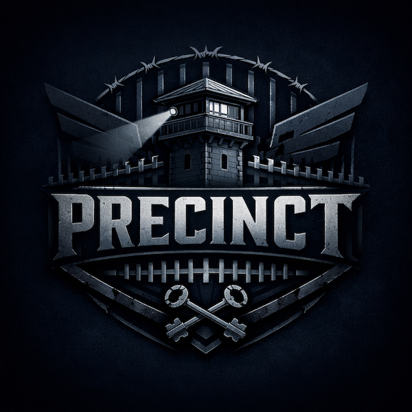

<p align="center">
  
</p>

<p align="center">
  <strong>Enterprise Agentic Security on Infrastructure You Already Trust</strong>
</p>

<p align="center">
  <a href="https://github.com/precinct-dev/PRECINCT/actions/workflows/ci.yaml"></a>
  <a href="LICENSE"></a>
  <a href="https://pkg.go.dev/github.com/precinct-dev/precinct"></a>
  <a href="https://precinct.dev"></a>
</p>

---

> Website: [https://precinct.dev](https://precinct.dev)

Kubernetes. Docker. SPIFFE. OPA. SPIKE. Decades of combined production mileage,
assembled into a single agentic security substrate. Many frameworks propose
entirely new paradigms -- novel runtimes and sandboxes that still need to earn
enterprise trust. PRECINCT assembles what already has it. Your stack stays.
Your processes stay. Your auditors already understand the components.

PRECINCT is both a **framework** and a **reference architecture**: the core
gateway is tightly integrated, but everything around it is adaptable and
pluggable. It sits between AI agents and MCP tool servers, enforcing a 13-layer
middleware chain -- authentication, authorization, audit, data-loss prevention,
rate limiting, and late-binding secret management -- without agents needing to
know about any of it.

```
Agent --> [Auth] --> [Audit] --> [Policy] --> [DLP] --> [Session] --> [StepUp]
      --> [DeepScan] --> [RateLimit] --> [CircuitBreaker] --> [TokenSub] --> MCP Server
```

Third-party tools (DSPy, LangGraph, CrewAI, mcp2cli, or any MCP client) work
inside PRECINCT without modification via an Envoy sidecar that injects SPIFFE
identity automatically.


## Who Is This For?

- **Platform and infrastructure teams** deploying AI agents in production and
  needing zero-trust security, immutable audit trails, and compliance evidence
  without building it all from scratch
- **Security and compliance teams** who need inspectable controls, framework
  mappings (SOC 2, ISO 27001, GDPR, HIPAA, PCI-DSS, NIST), and machine-readable
  evidence -- not vendor promises
- **Developers** integrating agents with external tools via MCP who want
  security enforcement handled at the infrastructure layer, not bolted into
  every agent
- **Researchers** studying agentic security architectures (the
  [reference architecture](docs/architecture/reference-architecture.md) and
  [research foundations](https://precinct.dev/pages/research.html) are published
  alongside this implementation)


## What This Is NOT

- **Not an LLM orchestrator.** PRECINCT does not prompt models, manage chains,
  or decide which tools to call. Agents make their own decisions; PRECINCT
  enforces security policy on the resulting tool calls.
- **Not an MCP server.** It mediates access to MCP servers, adding security
  enforcement that the MCP protocol alone does not provide.
- **Not a closed platform.** Every layer is inspectable. Every policy decision
  is logged. Every component is open source (Apache 2.0). No vendor lock-in.


## Quick Start

Prerequisites: Docker, Docker Compose, Go 1.26.2+, make. No API keys required.

```bash
# Start observability (traces)
make phoenix-up

# Start the full stack (SPIRE, SPIKE, KeyDB, gateway, control, mock MCP server)
make up

# Run the E2E demo -- 84 tests across Go and Python SDKs, no mocks
make demo-compose
```

Expected output: all 84 tests pass. Every middleware layer is exercised with
real requests through the full stack.

Phoenix UI: `http://localhost:6006` for distributed trace inspection.

### About the Guard Model (Layer 10)

Layer 10 (Deep Scan) uses an LLM-based guard model to classify content that the
regex-based DLP scanner at layer 7 flags but cannot conclusively block -- prompt
injections, jailbreak attempts, and other adversarial patterns that require
semantic understanding.

**Without a Groq API key**, the stack runs with a built-in mock guard model that
returns deterministic classifications for testing. The other 12 middleware layers
are fully functional. The step-up gating at layer 9 degrades gracefully to
fail-open for the guard check (all other step-up logic remains enforced).

**With a Groq API key**, the guard model calls
[Prompt Guard 2](https://huggingface.co/meta-llama/Llama-Prompt-Guard-2-86M)
via the Groq inference API for real-time content classification. Groq was chosen
because Prompt Guard 2 is a dedicated security classifier (not a general-purpose
LLM) and Groq provides the lowest-latency inference for it -- important since
deep scan is on the synchronous request path. You can substitute any
OpenAI-compatible endpoint by setting `GUARD_MODEL_ENDPOINT` and `GUARD_API_KEY`.

To enable the real guard model:

```bash
export GROQ_API_KEY=your-key-here
make down && make up
```

To explicitly disable deep scan and run with 12 layers:

```bash
export DEEP_SCAN_FALLBACK=fail_open
```

See the [Deployment Guide](docs/deployment-guide.md) for Docker Compose,
Kubernetes, and production setup instructions.


## How It Works

The gateway runs as two services:

- **precinct-gateway** -- data-plane enforcement on the latency-sensitive
  request path
- **precinct-control** -- admin and control-plane APIs

Both share the same 13-layer middleware chain:

| # | Layer | What It Does |
|---|-------|-------------|
| 1 | Size Guard | Rejects oversized payloads (default 10 MB) |
| 2 | Shape Validator | Validates JSON-RPC 2.0 envelope structure |
| 3 | SPIFFE Auth | Validates cryptographic identity (mTLS in prod, header in dev) |
| 4 | Audit Logger | Structured decision journal with OTel spans and hash chaining |
| 5 | Tool Registry | Verifies tool existence and SHA-256 content hash |
| 6 | OPA Policy | Embedded Rego evaluation (grants, risk levels, principal hierarchy) |
| 7 | DLP Scanner | Credential blocking, PII detection, injection pattern flagging |
| 8 | Session Context | Cross-request exfiltration detection via KeyDB |
| 9 | Step-Up Gating | Risk-based approval flow with reversibility classification |
| 10 | Deep Scan | LLM-based content analysis via configurable guard model |
| 11 | Rate Limiter | Token bucket per SPIFFE ID via KeyDB |
| 12 | Circuit Breaker | Per-tool circuit breaker (closed/open/half-open) |
| 13 | Token Substitution | SPIKE late-binding secret injection (always innermost) |

The gateway also exposes five control-plane endpoints for framework-agnostic
governance across ingress, context, model, tool, and loop planes. See the
[API Reference](docs/api-reference.md) for the full wire format.

### Supporting Infrastructure

| Component | Role |
|-----------|------|
| [SPIRE](https://spiffe.io/) | SPIFFE identity for all workloads (mTLS-ready) |
| [SPIKE Nexus](https://github.com/spiffe/spike) | Late-binding secret vault with SPIFFE access control |
| [KeyDB](https://docs.keydb.dev/) | Session state and rate-limit counters |
| [OPA](https://www.openpolicyagent.org/) | Policy-as-code with Rego |
| [Phoenix](https://phoenix.arize.com/) + OTel | Distributed tracing and observability |
| OpenSearch (optional) | Indexed audit evidence for compliance and forensics |


## Deployment

| Mode | Use Case | Command |
|------|----------|---------|
| Docker Compose | Local development and demos | `make up` |
| Kubernetes (local) | Docker Desktop K8s | `make k8s-up` |
| Kubernetes (EKS) | Production | See [cloud playbooks](docs/architecture/cloud-adaptation-playbooks.md) |

All modes use the same gateway binary, the same middleware chain, and the same
OPA policies. The difference is how identity (SPIFFE) and secrets (SPIKE) are
bootstrapped.

See [docs/architecture/deployment-patterns.md](docs/architecture/deployment-patterns.md)
for the full deployment architecture.


## SDKs

| Language | Package | Docs |
|----------|---------|------|
| Go | `github.com/precinct-dev/precinct/sdk/go/mcpgateway` | [sdk/go/README.md](sdk/go/README.md) |
| Python | `mcp-gateway-sdk` | [sdk/python/README.md](sdk/python/README.md) |

Tools that cannot integrate an SDK can use the
[Envoy sidecar](docs/sidecar-identity.md) for automatic SPIFFE identity
injection with zero code changes.


## Directory Structure

```
cmd/gateway/              Gateway binary entrypoint
internal/gateway/         Gateway core + 13-layer middleware chain
config/                   OPA policies, tool registry, SPIFFE IDs, risk thresholds
sdk/go/                   Go SDK
sdk/python/               Python SDK
deploy/compose/           Docker Compose files and Dockerfiles
deploy/k8s/               Kubernetes manifests (base + overlays)
deploy/terraform/         EKS-specific Terraform and Kustomize overlays
deploy/sidecar/           Envoy sidecar for third-party tools
deploy/helm/              Helm chart
tools/compliance/         GDPR/SOC2/ISO27001/NIST compliance automation
cli/                      PRECINCT CLI
examples/                 Starter examples and test fixtures
contracts/                PRECINCT specification versions
docs/                     All documentation
tests/                    E2E, integration, benchmark, and conformance tests
```


## Make Commands

Run `make help` for the full list. Key targets:

| Target | Description |
|--------|-------------|
| `make setup` | Interactive setup wizard |
| `make up` / `make down` | Start / stop Docker Compose stack |
| `make demo-compose` | Run E2E demo (Docker Compose) |
| `make demo-k8s` | Run E2E demo (Kubernetes) |
| `make test` | Run all tests (unit + integration + OPA) |
| `make lint` | Run linters |
| `make phoenix-up` | Start Phoenix observability stack |
| `make opensearch-up` | Start OpenSearch compliance stack |
| `make k8s-up` / `make k8s-down` | Deploy / tear down local Kubernetes |
| `make security-scan` | Run security scans (gosec, trivy, hadolint, trufflehog) |
| `make production-readiness-validate` | Full security + policy + manifest gate |
| `make compliance-report` | Generate SOC2/ISO27001/NIST compliance report |
| `make gdpr-delete SPIFFE_ID=...` | GDPR right-to-erasure |
| `make benchmark` | Performance benchmarks |
| `make clean` | Full cleanup |


## Documentation

| Topic | Link |
|-------|------|
| Documentation index | [docs/README.md](docs/README.md) |
| Reference architecture | [docs/architecture/reference-architecture.md](docs/architecture/reference-architecture.md) |
| API reference | [docs/api-reference.md](docs/api-reference.md) |
| Deployment guide | [docs/deployment-guide.md](docs/deployment-guide.md) |
| Configuration reference | [docs/configuration-reference.md](docs/configuration-reference.md) |
| SPIFFE/SPIRE identity setup | [docs/spiffe-setup.md](docs/spiffe-setup.md) |
| SPIKE late-binding secrets | [docs/spike-token-substitution.md](docs/spike-token-substitution.md) |
| Cloud adaptation playbooks | [docs/architecture/cloud-adaptation-playbooks.md](docs/architecture/cloud-adaptation-playbooks.md) |
| Multi-agent orchestration | [docs/patterns/multi-agent-orchestration.md](docs/patterns/multi-agent-orchestration.md) |
| Security baseline | [docs/security/baseline.md](docs/security/baseline.md) |
| Zero-trust FAQ | [docs/security/agentic-zero-trust-faq.md](docs/security/agentic-zero-trust-faq.md) |
| Performance benchmarks | [docs/operations/performance.md](docs/operations/performance.md) |
| GDPR Article 30 compliance | [docs/compliance/gdpr-article-30-ropa.md](docs/compliance/gdpr-article-30-ropa.md) |
| Go SDK | [sdk/go/README.md](sdk/go/README.md) |
| Python SDK | [sdk/python/README.md](sdk/python/README.md) |


## Contributing

See [CONTRIBUTING.md](CONTRIBUTING.md). Every PR requires unit tests, integration
tests against real dependencies (no mocks), and E2E coverage of affected paths.

## Security

See [SECURITY.md](SECURITY.md). To report a vulnerability, use
[GitHub Security Advisories](https://github.com/precinct-dev/precinct/security/advisories/new).

## License

[Apache License 2.0](LICENSE)
