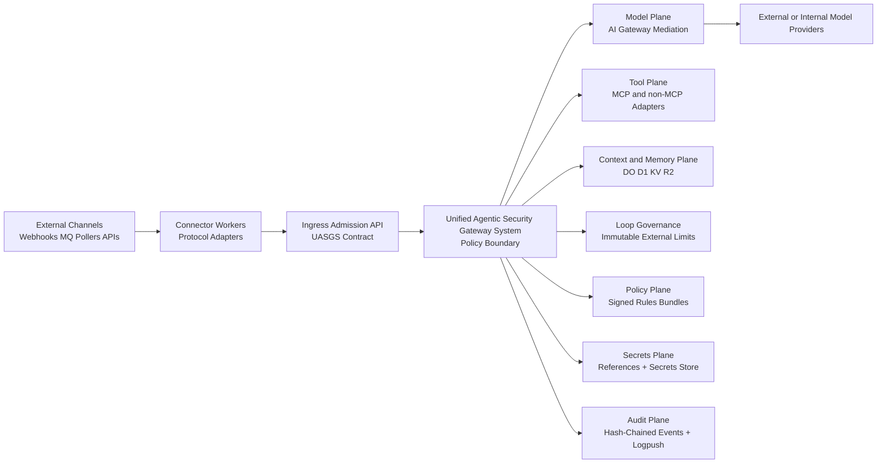

# Agentic AI Security Reference Architecture
## Cloudflare Workers Adaptation Profile (UASGS)

Version: 1.0  
Date: 2026-02-12  
Status: Architecture profile proposal

---

## 1) Purpose

This document defines how to implement the reference architecture on Cloudflare Workers while preserving the same core security posture:

- one mandatory policy boundary (UASGS)
- one audit/evidence contract
- one identity and secrets discipline
- full coverage of all five agentic planes (ingress, model, tool, context/memory, loop)

It is an adaptation profile, not a downgrade profile.

---

## 2) Scope and Non-Goals

In scope:
- Cloudflare-native deployment patterns for UASGS controls
- required compensating controls where Kubernetes-native controls are unavailable
- implementable guidance for ingress channels (webhooks, queues, event sources)
- model-provider governance including budget, fallback, and trust checks
- DLP RuleOps (CRUD + approvals + signed promotion)

Out of scope:
- replacing the primary Kubernetes profile
- claiming 1:1 equivalence for every SPIFFE/SPIRE runtime behavior
- vendor lock to any one DLP engine

---

## 3) Executive Position

Cloudflare Workers can host a defensible UASGS profile if we keep hard invariants and accept explicit compensating controls.

### 3.1 Mandatory Invariants

1. No direct model-provider calls from agent runtimes in production.
2. No direct tool execution path that bypasses Tool Plane policy.
3. No-scan-no-send for prompt/context material to any model endpoint.
4. Ingress events must be normalized into a signed envelope and admitted by policy.
5. Loop governance is external and immutable at boundary crossings (not framework-internal takeover).
6. All decisions emit reason-coded audit events.

### 3.2 The 3 Rs in Cloudflare Terms

- Repair: multi-POP edge runtime, retries, queue backpressure, and DO recovery patterns.
- Rotate: short-lived access tokens where possible, centralized secret rotation through Secrets Store, credential-by-reference.
- Repave: immutable deployment artifacts, environment recreation, namespace/keyspace reset, and policy/data re-seeding.

---

## 4) UASGS Plane Mapping to Cloudflare

| UASGS Plane | Cloudflare Primitives | Enforceability | Notes |
|---|---|---|---|
| Ingress Plane | Workers HTTP handlers, Queues consumers, API Shield, WAF | Strong | Connector pattern avoids protocol MITM requirement |
| Model Plane | AI Gateway, authenticated gateway tokens, dynamic routing | Strong | Budget/fallback/rate limits are first-class policy variables |
| Tool Plane | Worker service bindings, Queue jobs, adapter Workers, outbound allowlists | Strong | Supports MCP and non-MCP (CLI bridge, HTTP, custom RPC) |
| Context/Memory Plane | Durable Objects, D1, KV, R2 | Strong with design discipline | DO for coordination, D1 for governed state, KV for cache/tags |
| Loop Plane | External limits in DO + policy checks at every boundary call | Strong (external) | Framework loop internals stay untouched |
| Policy Plane | OPA-compatible policy bundles, signed data artifacts, version pinning | Strong | Evaluation can be in-process or policy sidecar service |
| Audit Plane | Logpush, hash-chained audit records, R2/D1 retention controls | Strong | Requires immutable export strategy for evidence-grade logs |
| Secrets Plane | Secrets Store + Worker Secrets + reference indirection | Medium-Strong | Strong secret hygiene; not a native SPIFFE/SPIRE replacement |
| Identity Plane | API Shield JWT/mTLS + service identity contracts + mTLS bindings | Medium-Strong | Needs compensating controls for workload identity parity |

---

## 5) Reference Architecture (Cloudflare Profile)



---

## 6) Practical Implementation Guidance

## 6.1 Ingress Plane (No Universal MITM)

The gateway does not need to implement every protocol backend.

Pattern:
1. Connector owns provider protocol details (WhatsApp, Telegram, Slack, Kafka bridge, RabbitMQ bridge, custom webhook).
2. Connector emits canonical ingress envelope.
3. UASGS ingress admission performs identity, replay, schema, DLP/prompt-safety, tenancy, and policy checks.
4. Only admitted envelopes reach agent runtime.

Canonical envelope minimum:
- `event_id`, `source`, `provider`, `tenant`, `actor`, `timestamp`, `payload_ref_or_inline`
- `integrity` (signature/hash), `trace_id`, `risk_tags`, `classification`

Required controls:
- anti-replay window + nonce tracking
- strict schema versioning
- per-channel ACL and tenant policy
- deterministic decision codes: `allow`, `quarantine`, `deny`, `step_up`

For external MQ systems:
- Use bridge connectors (outside or inside Workers) that submit normalized envelopes.
- Keep one ingress contract, not N protocol-specific policy engines.

## 6.2 Model Plane (Provider Governance as Policy)

All model egress transits AI Gateway (or UASGS egress broker in front of it).

Policy dimensions:
- allowed provider/model/endpoint
- residency and jurisdiction intent
- budget policy (tenant/team/workload/time-window)
- latency and availability class
- fallback chain and terminal behavior
- data classification and fail-open/fail-closed mode

Recommended runtime behavior:
- budget near threshold: downgrade model class and emit warning event
- budget exceeded: deny with explicit reason code and optional approved fallback
- provider outage/high latency: deterministic fallback route order
- every provider error (401/403/429/5xx) mapped to normalized SDK reason codes

Minimum trust posture:
- authenticated AI Gateway only
- hard allowlist of gateway and approved provider routes
- no direct provider credentials in app code
- gateway-level DLP/guardrails enabled where available

## 6.3 Tool Plane (MCP and Non-MCP)

Tool Plane is protocol-agnostic by design.

Supported patterns:
- MCP tools
- HTTP tools
- RPC/service-binding tools
- controlled CLI execution via dedicated runner services

Required controls:
- signed tool registry and hash verification
- capability grants by tenant, app, and run risk level
- argument schema validation and response firewall
- strong audit on request, policy input, policy decision, and output

## 6.4 Context and Memory Plane

Recommended split:
- Durable Objects: run coordination, locks, counters, immutable limit tracking
- D1: relational memory metadata, policy decision traces, rule versions
- KV: short-lived caches, idempotency keys, replay windows
- R2: large artifacts, transcripts, evidentiary archives

Mandatory context-admission controls:
- prompt injection scan before context enters model-bound payload
- DLP classification and redaction/tokenization before model send
- provenance tags on every context segment
- policy decision recorded for each admission event

## 6.5 Loop Plane (Unintrusive by Default)

Do not replace framework loop engines.

Enforce from outside:
- max iterations
- max wall-clock runtime
- token budget
- action/tool budget
- escalation thresholds

Enforcement point:
- each boundary crossing (ingress admission, model call, tool call, memory write)

This gives hard control without forcing framework-specific DAG/FSM integration.

## 6.6 RLM Pattern (Recursive Language Model Workloads)

For RLM-like execution (LLM-generated code paths, internal REPL behavior):
- treat spawned execution contexts as tool executions with separate capability scopes
- enforce no-scan-no-send on any generated prompts/context
- require explicit sub-call budget partitioning (parent vs child)
- emit parent-child provenance links in audit events

If heavy REPL compute exceeds Workers constraints, route execution to isolated runner services through Tool Plane contracts, not direct bypass paths.

---

## 7) Identity and Secrets Adaptation

## 7.1 Identity

Cloudflare Workers does not natively provide SPIFFE/SPIRE-equivalent workload SVID lifecycle.

Compensating control stack:
- ingress client identity via API Shield JWT/mTLS where available
- connector/service identity via signed service tokens and strict audience checks
- service-to-service trust via mTLS bindings and allowlisted destinations
- optional hybrid federation: keep SPIFFE in private control plane, issue short-lived derived assertions for Workers calls

## 7.2 Secrets

Use reference-based secret retrieval:
- app/runtime carries only `credential_ref`
- resolver retrieves secret material from Secrets Store at execution time
- rotate secrets through staged rollover (primary + fallback binding)
- never log secret values

Important limit notes:
- Secrets Store limits and scope constraints require governance at scale
- treat secret retrieval failures as explicit policy failures, not silent fallback

---

## 8) DLP RuleOps and HIPAA-Oriented Guardrails

DLP is pluggable:
- customer-owned DLP
- third-party DLP service
- internal DLP engine

Architecture requirement is control consistency, not vendor lock.

### 8.1 DLP RuleOps Lifecycle

1. Author rule change via API/CLI.
2. Validate syntax + dry-run against test corpus.
3. Require approval (security/compliance owner).
4. Sign bundle and promote by version.
5. Roll out with canary mode.
6. Emit immutable audit events for create/update/delete/promote/rollback.

### 8.2 HIPAA Profile Defaults

- no raw PHI/PII classes in prompts to external providers unless explicit approved exception
- fail-closed on high-risk detections
- deterministic redaction/tokenization before any model egress
- evidence logs store decision metadata, not raw sensitive payloads

---

## 9) Compliance and Assurance Mapping (Cloudflare Profile)

| Standard | Cloudflare Profile Contribution | Remaining Responsibility |
|---|---|---|
| SOC 2 Type 2 | Central policy enforcement, audit trail, access controls, change tracking | Organizational controls, reviewer evidence process, incident ops |
| ISO 27001 | Risk treatment controls in policy, logging, key management discipline | ISMS governance, SoA maintenance, internal audit cadence |
| CCPA/CPRA | Data minimization, purpose tagging, deletion workflows via governed stores | DSAR process execution, legal basis and disclosure management |
| GDPR | Residency-aware routing, access controls, auditability, retention governance | DPA, RoPA, lawful basis, cross-border legal governance |
| HIPAA | PHI/PII prompt controls, DLP/redaction, access traceability | BAA, workforce process controls, administrative safeguards |

---

## 10) RACI (Cloudflare Profile Essentials)

| Control Area | Platform Eng | Security Eng | SRE | App Team | Compliance | Legal |
|---|---|---|---|---|---|---|
| UASGS policy contracts and bundles | R | A | C | C | I | I |
| AI Gateway provider/budget/residency policy | C | A/R | C | C | C | C |
| Ingress connector conformance | R | A | C | R | I | I |
| DLP RuleOps approval and promotion | C | A/R | I | C | R | C |
| Audit retention and evidence export | R | A | R | I | C | I |
| HIPAA prompt-safety exception handling | I | R | I | C | A | A/R |

Legend: `A` Accountable, `R` Responsible, `C` Consulted, `I` Informed.

---

## 11) Residual Gaps and Compensating Controls

## 11.1 Gap: SPIFFE/SPIRE parity in pure Workers runtime

- Impact: workload identity model is not equivalent to per-workload SVID issuance.
- Compensating controls: strict service identity contracts, mTLS/JWT enforcement, short-lived tokens, optional hybrid SPIFFE federation.

## 11.2 Gap: Endpoint attestation depth for third-party model providers

- Impact: fine-grained endpoint attestation and DNS integrity proofs are limited in pure app code.
- Compensating controls: force AI Gateway mediation, hard route allowlists, authenticated gateway, egress policy checks, continuous synthetic trust probes.

## 11.3 Gap: Product tier dependencies (API Shield and some advanced controls)

- Impact: control availability may vary by plan.
- Compensating controls: document profile-level mandatory/optional controls and block production accreditation claims if mandatory controls are absent.

## 11.4 Gap: Stateful limits and runtime constraints

- Impact: large/long compute (including some RLM workflows) may exceed Workers limits.
- Compensating controls: offload heavy execution to isolated runners via Tool Plane while preserving the same UASGS contracts.

## 11.5 Gap: External broker protocol diversity

- Impact: Workers profile does not natively replace every enterprise messaging system.
- Compensating controls: connector bridge strategy with conformance tests and canonical ingress envelope.

---

## 12) Deployment Profiles

## 12.1 `cf-core` (Minimum defensible)

Required:
- UASGS boundary enforced
- ingress envelope + admission policy
- AI Gateway mediation for model calls
- DLP no-scan-no-send baseline
- reason-coded audit logs with export

## 12.2 `cf-regulated` (Recommended for accreditation posture)

Adds:
- strict fail-closed data-class controls
- policy-signed DLP RuleOps with approvals
- residency constraints for model and memory paths
- immutable evidence export and retention profiles
- hybrid identity hardening where needed

---

## 13) Implementation Blueprints

## 13.1 Baseline Worker Configuration (Illustrative)

```jsonc
{
  "name": "uasgs-edge",
  "main": "src/index.ts",
  "compatibility_date": "2026-02-01",
  "observability": { "enabled": true, "head_sampling_rate": 0.1 },
  "limits": { "cpu_ms": 300000 },
  "durable_objects": {
    "bindings": [{ "name": "RUN_GOVERNOR", "class_name": "RunGovernorDO" }]
  },
  "migrations": [{ "tag": "v1", "new_sqlite_classes": ["RunGovernorDO"] }],
  "d1_databases": [{ "binding": "POLICY_DB", "database_name": "uasgs-policy", "database_id": "TBD" }],
  "kv_namespaces": [{ "binding": "RISK_CACHE", "id": "TBD" }],
  "r2_buckets": [{ "binding": "EVIDENCE_BUCKET", "bucket_name": "uasgs-evidence" }],
  "queues": {
    "producers": [{ "binding": "INGRESS_QUEUE", "queue": "uasgs-ingress" }],
    "consumers": [{ "queue": "uasgs-ingress" }]
  },
  "services": [{ "binding": "TOOL_RUNNER", "service": "uasgs-tool-runner" }],
  "vars": {
    "PROFILE": "cf-core",
    "AI_GATEWAY_ID": "TBD",
    "AI_GATEWAY_ACCOUNT_ID": "TBD"
  }
}
```

## 13.2 Model Policy Contract (Illustrative)

```json
{
  "provider": "openai",
  "model": "gpt-4o",
  "tenant": "tenant-a",
  "allowed_regions": ["us", "eu"],
  "data_classification": "internal",
  "budget_profile": {
    "daily_usd_limit": 500,
    "soft_threshold_percent": 80,
    "hard_stop_percent": 100
  },
  "latency_slo_ms": 2500,
  "fallback_chain": [
    { "provider": "anthropic", "model": "claude-sonnet-4-5" },
    { "provider": "workersai", "model": "@cf/meta/llama-3.1-8b-instruct" }
  ],
  "failure_mode": "fail_closed"
}
```

## 13.3 Ingress Decision Codes (Minimum Set)

- `INGRESS_ALLOW`
- `INGRESS_DENY_SCHEMA`
- `INGRESS_DENY_REPLAY`
- `INGRESS_DENY_IDENTITY`
- `INGRESS_QUARANTINE_DLP`
- `INGRESS_STEP_UP_REQUIRED`
- `MODEL_DENY_BUDGET`
- `MODEL_FALLBACK_APPLIED`
- `LOOP_HALT_LIMIT_EXCEEDED`
- `TOOL_DENY_CAPABILITY`

## 13.4 DLP RuleOps API Surface (Minimum)

- `POST /v1/dlp/rules` create draft rule
- `PUT /v1/dlp/rules/{id}` update draft
- `POST /v1/dlp/rules/{id}/validate` run test corpus
- `POST /v1/dlp/rules/{id}/approve` approval with signer identity
- `POST /v1/dlp/bundles/promote` signed bundle promotion
- `POST /v1/dlp/bundles/rollback` controlled rollback
- `GET /v1/dlp/events` immutable lifecycle audit stream

## 13.5 Channel Adapter Flow (WhatsApp/Telegram Pattern)

1. Provider webhook arrives at connector Worker endpoint.
2. Connector validates provider signature and freshness.
3. Connector emits canonical envelope and pushes to `INGRESS_QUEUE`.
4. UASGS consumer performs admission checks and stores verdict.
5. Agent runtime consumes admitted event only.
6. Outbound message intent returns through Tool Plane egress broker.
7. Provider delivery response is normalized and audited with reason codes.

---

## 14) Recommended Next Steps

1. Adopt this as an official deployment profile document under the reference architecture family.
2. Add profile-level acceptance checks (`cf-core`, `cf-regulated`) to STRIDE/PASTA and compliance evidence tooling.
3. Create conformance tests for ingress connectors, model egress mediation, DLP RuleOps lifecycle, and loop immutable limits.
4. Define one reference adapter (WhatsApp or Telegram) as the exemplar to prove channel portability.
