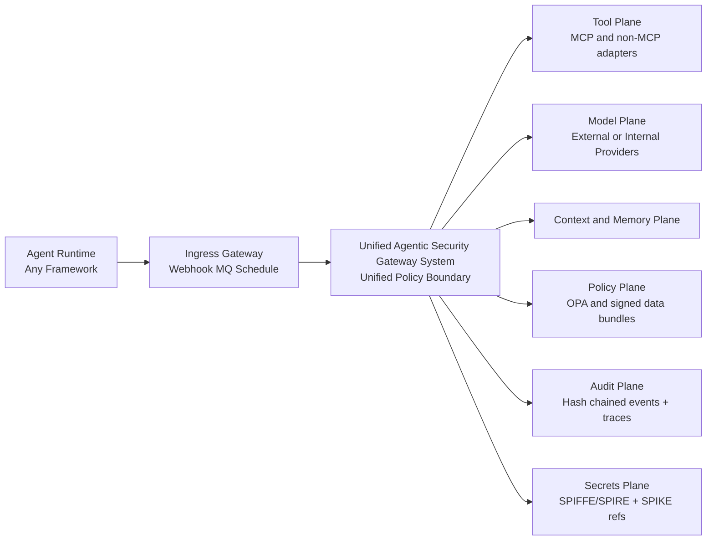

# Agentic AI Security Reference Architecture
## Phase 3 Proposal: Unified Agentic Security Gateway System (LLM, Memory, Tool, Loop, Ingress)

Version: 1.1  
Date: 2026-02-11  
Status: Proposal (not yet approved for implementation)

---

## 1) Executive Summary

Phase 1 and Phase 2 proved a strong tool-centric gateway security model. Phase 3 should extend that model to cover the full lifecycle of modern agentic systems:

1. LLM plane (reasoning/orchestration model calls)
2. Context and memory plane (state continuity and knowledge persistence)
3. Tool Plane (external actions across MCP and non-MCP protocols)
4. Control loop plane (iteration, budgets, stop conditions)
5. Input/event ingress plane (webhooks, queues, triggers)

Core proposal:
- Keep one policy and evidence boundary.
- Evolve the current gateway into a **Unified Agentic Security Gateway System (UASGS)** with clear subsystems and planes.
- Preserve developer freedom through open contracts while making unsafe paths hard to use.

This proposal is intentionally opinionated on controls and intentionally flexible on frameworks and providers.

---

## 2) Why Phase 3 Now

Current architecture strength:
- Tool Plane controls are mature and tested.

Current architecture gap:
- Controls for model egress, memory governance, loop governance, and event ingress are fragmented or partial.
- Provider cost/performance/availability policy is not yet first-class in model egress decisions.

Market reality:
- Most enterprises will run external model providers.
- Most production agents are event-driven.
- Most production agents require memory beyond single request scope.

If these planes are not centrally governed, teams reintroduce risk through side channels even when tool controls are strong.

---

## 3) Design Principles

### 3.1 The 3 Rs (Operating Doctrine)

- Repair: self-heal quickly under failure and attack.
- Rotate: short-lived identity and referential credentials by default.
- Repave: rebuild trusted runtime state on demand to reduce persistence risk.

### 3.2 Roads, Not Cages

- Make the secure path the default and easiest path.
- Allow controlled flexibility for frameworks and providers.
- Enforce hard boundaries only where risk is irreversible or high impact.

### 3.3 Illusion of Freedom (Developer Experience Contract)

Teams keep freedom to choose:
- Agent frameworks
- Model providers
- Internal orchestration patterns

Teams do not bypass:
- UASGS policy boundary
- Identity and egress controls
- Audit and evidence contracts

### 3.4 One Policy Plane, One Evidence Plane

All five agentic planes must produce:
- Consistent policy inputs/decisions
- Consistent audit event schema
- Consistent compliance evidence extraction

### 3.5 Framework-Compatible Governance

Phase 3 controls must be enforceable without requiring framework rewrites.

Design rule:
- UASGS governs boundaries (ingress, model egress, tool execution, memory IO), not internal framework orchestration semantics.
- UASGS does not require ownership of framework loop/DAG/FSM internals to enforce safety outcomes.

Implication:
- Framework-native loop/DAG/FSM engines remain primary for local orchestration.
- UASGS applies immutable external limits and policy gates at boundary crossings.
- Optional deeper integration is additive, never mandatory.
- Production minimum is boundary governance, not loop-engine replacement.

### 3.6 Compliance-by-Construction Defaults (This Revision)

To close architecture-level gaps before operational rollout, Phase 3 now sets explicit default invariants:

- **No direct model egress in production**: provider calls must transit UASGS model plane.
- **Fail-closed on high-risk data classes**: no fail-open path for regulated/sensitive prompts.
- **No-scan-no-send** for all model-bound context.
- **No raw PHI/PII in prompts** in HIPAA profile unless explicit policy exception and approval code.
- **DLP rules are governed artifacts**: signed, versioned, reviewed, and rollback-capable.
- **Connector conformance is required**: ingress adapters must pass contract tests before production admission.

---

## 4) Scope and Non-Goals

### 4.1 In Scope

- Architecture for governance and enforcement across all five planes
- Recommended component boundaries and interfaces
- Policy and audit schema extensions
- Story-ready decomposition model for backlog conversion

### 4.2 Out of Scope

- Implementing code in this proposal
- Binding to one cloud vendor
- Replacing existing Phase 1/2 controls

---

## 5) Current vs Target Maturity

| Plane | Current | Target (Phase 3) |
|---|---|---|
| LLM plane | Partial | Mandatory gateway-mediated model egress controls |
| Context/memory plane | Partial | Memory governance with policy, provenance, lifecycle |
| Tool Plane | Strong | Strong + unified capability model + protocol adapters |
| Control loop plane | Partial | Explicit loop governor with deterministic budgets and halt reasons |
| Input/event ingress plane | Gap | First-class ingress security and trigger governance |

---

## 6) Target Architecture (Logical)



### 6.1 Logical Components

- Ingress Gateway (new logical module)
- Unified Agentic Security Gateway System core (existing gateway, expanded)
- Model Egress subsystem (new UASGS module)
- Tool Plane subsystem with protocol adapters (new UASGS module)
- Loop Governor subsystem (new UASGS module)
- Context/Memory subsystem or service (new governed capability)
- Existing policy, identity, secrets, and audit planes (expanded schemas)

---

## 7) Plane-by-Plane Deep Dive

## 7.1 LLM Plane (Model Egress Governance)

### 7.1.1 Threat Model

- Provider endpoint spoofing or misrouting
- Key leakage in app services
- Unapproved provider/model usage
- Data residency violations
- Inconsistent TLS/DNS trust validation across teams
- Provider budget exhaustion and unmanaged cost spikes
- Provider brownouts (latency/uptime degradation) without deterministic fallback behavior

### 7.1.2 Control Objectives

- All model egress goes through governed mediation.
- Credentials are always reference-based, never app-embedded.
- Provider, endpoint, model, and region are policy-evaluated.
- Endpoint trust is validated consistently.
- Cost, latency, uptime, and error-rate constraints are enforceable policy variables.
- Budget exhaustion and provider degradation have deterministic operator-visible outcomes.
- Production workloads cannot bypass mediated model egress paths.

### 7.1.3 Proposed Pattern

- Add `ModelEgressMiddleware` in gateway chain for model calls.
- Define provider catalog in signed policy data:
  - provider id
  - allowed endpoints
  - allowed models
  - allowed regions/jurisdictions
  - trust requirements (TLS, pinning policy, DNS integrity mode)
  - cost policy (budget caps by tenant/workload/time window)
  - performance policy (latency SLO class, minimum availability threshold)
  - fallback policy (ordered alternates, fail-open/fail-closed behavior by risk class)
  - regulated profile defaults (high-risk disclosure classes must fail-closed)
- Support secret references for model API auth (SPIKE refs).
- Define network enforcement profile:
  - only UASGS model-plane identity may egress to provider endpoints
  - agent workloads are denied direct model-provider egress by network policy/firewall
  - DNS allowlists and endpoint identity validation are mandatory in regulated profiles

### 7.1.4 Interface Contract (Proposed)

`POST /v1/model/call`

Required request fields:
- `provider`
- `model`
- `credential_ref`
- `purpose`
- `tenant`
- `data_classification`
- `residency_intent`
- `budget_profile`
- `latency_tier`
- `session_id`

Gateway behavior:
1. Verify caller identity and grant.
2. Resolve credential reference.
3. Enforce provider/model/region policy.
4. Enforce budget and QoS policy.
5. Apply endpoint trust policy.
6. Apply fallback chain if configured and safe.
7. Emit decision and egress audit event.
8. Forward request only on allow.

### 7.1.5 Evidence Signals

- `model.provider.allowed` and `model.provider.denied` events
- Endpoint trust failure events
- Residency gate deny events
- Credential reference usage logs (no raw key)
- Budget exhaustion events (`model.provider.budget_exhausted`)
- Fallback events (`model.provider.fallback_applied`)
- Performance-governance events (`model.provider.slo_violation`)
- Direct-egress deny events (`model.provider.direct_egress_blocked`)

### 7.1.6 Failure Behavior and SDK Contract

Policy-level model egress failures should produce structured, machine-actionable outcomes:
- `MODEL_PROVIDER_DENIED`
- `MODEL_PROVIDER_BUDGET_EXHAUSTED`
- `MODEL_PROVIDER_RESIDENCY_DENIED`
- `MODEL_PROVIDER_TRUST_VALIDATION_FAILED`
- `MODEL_PROVIDER_DEGRADED_NO_APPROVED_FALLBACK`

SDKs should expose:
- explicit reason code and policy decision id
- recommended retry/fallback behavior when allowed
- user-facing diagnostic messages suitable for application logs and runbooks
- optional automatic fallback execution only when policy pre-authorizes it

SDK strategy:
- **Compatibility mode**: developers keep existing provider SDK usage but route calls through UASGS endpoint.
- **Managed mode**: UASGS SDK wrapper provides standardized error handling, fallback, and telemetry hooks.
- Both modes must produce the same policy reason codes and audit fields.

### 7.1.7 Mandatory Mediation Enforcement (Production Profile)

Production profile must enforce all three controls together:

1. **Policy gate**: model calls denied unless decision path is UASGS-mediated.
2. **Identity gate**: only model-plane workload identity can egress to provider endpoints.
3. **Network gate**: cluster/cloud egress policy blocks direct provider access from agent workloads.

This combination removes architecture-level ambiguity around bypass paths.

---

## 7.2 Context and Memory Plane

### 7.2.1 Threat Model

- Poisoned external context persistence
- Unbounded memory growth and data hoarding
- Sensitive memory reads leading to exfiltration
- Weak DSAR/deletion linkage to persistent memory

### 7.2.2 Control Objectives

- Memory writes are governed, classified, and attributable.
- Memory reads are purpose and policy constrained.
- Memory lifecycle (TTL, deletion, archive, legal hold) is explicit.
- Provenance is attached to persisted facts.
- Regulated profiles enforce minimum-necessary retrieval for model-bound context.

### 7.2.3 Proposed Memory Tiers

- Tier 0: Request-local ephemeral context (no persistence)
- Tier 1: Session memory (short TTL, high audit visibility)
- Tier 2: Durable operational memory (policy-gated)
- Tier 3: Curated knowledge memory (approval or stronger governance)

### 7.2.4 Proposed Controls

- `MemoryWritePolicy` by classification and source trust
- Provenance metadata on every write:
  - source type (tool, user, external fetch, derived)
  - source hash/reference
  - timestamp
  - confidence
- Read filtering by role, purpose, and classification
- Delete/export hooks tied to DSAR workflow
- Optional deterministic tokenization for PHI/PII fields before model-bound context composition
- Re-identification broker pattern (separate capability, higher-risk class, step-up protected)

### 7.2.5 Interface Contract (Proposed)

- `POST /v1/memory/write`
- `POST /v1/memory/read`
- `POST /v1/memory/delete`
- `POST /v1/memory/export`

All calls must carry:
- identity context
- session/run id
- purpose tag
- classification intent

---

## 7.3 Tool Plane (Protocol-Agnostic Actions)

### 7.3.1 Keep What Works

Preserve existing Tool Plane controls:
- hash and poisoning defense
- OPA grants
- step-up gating
- response firewall
- audit chain

### 7.3.2 Expand from MCP-only to protocol-adapted actions

The Tool Plane should support multiple action protocols via adapters:
- MCP tools (current default)
- governed CLI command adapters
- HTTP API adapters
- queue/task adapters

Each adapter must map to a canonical capability contract before execution.

### 7.3.3 CLI adapter controls (for non-MCP developer preference)

For custom CLI-style action paths, enforce:
- command allowlists and argument schema constraints
- execution sandboxing and resource limits
- restricted filesystem/network access
- deterministic stdout/stderr capture and redaction
- full decision and execution audit

### 7.3.4 Add Unified Capability Model

Treat tools, model calls, and ingress triggers as capabilities with shared metadata:
- `capability_type` (tool, model, ingress, memory)
- `risk_level`
- `effect_type` (read, write, external_egress, irreversible)
- `requires_step_up`
- `residency_constraints`
- `protocol` (mcp, cli, http, queue, custom)

This avoids fragmented policy logic across planes.

---

## 7.4 Control Loop Plane (Loop Governor)

### 7.4.1 Threat Model

- Infinite or runaway loops
- Recursive amplification and budget exhaustion
- Silent escalation from low-risk to high-risk actions
- Non-deterministic stop behavior

### 7.4.2 Control Objectives

- Every run has explicit budgets and stop conditions.
- External governance state transitions are auditable.
- High-risk transition points trigger step-up/approval.
- Provider budget and reliability signals influence control-loop decisions.
- Controls are minimally intrusive to framework-native loop engines.
- Internal framework state mapping is optional, not required for baseline adoption.

### 7.4.3 Proposed Run Envelope

Each run receives immutable limits:
- `max_steps`
- `max_tool_calls`
- `max_model_calls`
- `max_wall_time_ms`
- `max_egress_bytes`
- `max_model_cost_usd`
- `max_provider_failovers`
- `max_risk_score`

### 7.4.4 UASGS Run Governance States (External)

`CREATED -> RUNNING -> WAITING_APPROVAL -> RUNNING -> COMPLETED`  
`RUNNING -> HALTED_POLICY`  
`RUNNING -> HALTED_BUDGET`  
`RUNNING -> HALTED_PROVIDER_UNAVAILABLE`  
`RUNNING -> HALTED_OPERATOR`

Note:
- This is the **UASGS external governance state**, not a required replacement for framework-internal DAG/FSM state.
- These states are derived from boundary events and run lifecycle calls, not from mandatory framework instrumentation.

### 7.4.5 Loop Controls

- Per-boundary risk recalculation (model/tool/memory/egress actions)
- Budget decrement and threshold checks
- Mandatory reason code on every halt
- Operator kill switch by run/session id
- Policy-governed provider fallback evaluation when model calls fail or budgets are exhausted

### 7.4.6 Integration Modes (Intrusion Spectrum)

1. **Boundary-only mode (default)**  
   - UASGS enforces immutable limits and policy at each boundary call.
   - Framework loop internals remain untouched.
2. **Advisory bridge mode**  
   - Framework emits loop telemetry/events to UASGS for richer visibility and preemptive warnings.
3. **Native integration mode**  
   - Framework plugin maps internal state transitions directly to UASGS run states.
   - Use only where teams want deeper runtime coupling.

Recommendation:
- Start with boundary-only mode for broad adoption.
- Make deeper modes optional per framework.

### 7.4.7 Minimum Adoption Contract (No Framework Rewrite)

Required for production:
1. Agent creates a run envelope with immutable limits.
2. All boundary calls (model/tool/memory/ingress admission) flow through UASGS.
3. Agent handles UASGS halt reason codes deterministically.

Not required for production baseline:
- exposing internal loop nodes/edges to UASGS
- replacing framework-native DAG/FSM/loop runtime
- adopting a framework-specific plugin unless a team wants deeper observability

---

## 7.5 Input and Event Ingress Plane (New)

### 7.5.1 Why This Is Mandatory

Without ingress governance, agents can be triggered through unmanaged channels that bypass policy assumptions.

### 7.5.2 Supported Ingress Types

- Webhook ingress
- Queue ingress (Kafka, SQS, NATS, etc.)
- Schedule ingress (cron/event bridge)

### 7.5.3 Ingress Security Controls

- Source authentication (mTLS/JWT/HMAC/signature)
- Replay protection (timestamp + nonce + TTL)
- Schema validation and strict parsing
- Idempotency keys and dedupe window
- Rate limits and source quotas
- Quarantine and dead-letter routing for suspicious payloads
- Source-to-connector ACL validation at broker/webhook tier
- Connector attestation and conformance version check before registration

### 7.5.4 Normalized Event Envelope (Proposed)

```json
{
  "event_id": "evt-...",
  "source": {
    "type": "webhook",
    "id": "billing-system",
    "auth_method": "hmac"
  },
  "received_at": "2026-02-11T12:00:00Z",
  "schema": "com.acme.invoice.created.v1",
  "payload_ref": "$CTX{ref:...}",
  "classification": "internal",
  "replay_protected": true,
  "tenant": "tenant-a"
}
```

### 7.5.5 Ingress to Run Contract

- Ingress creates a `run_request` only after policy allow.
- Raw payloads become references before entering agent context.
- Every trigger is tied to a session/run id and trace.

### 7.5.6 Practical Implementation Guidance (Non-MITM by Default)

Clarification:
- UASGS does **not** need to become a universal transparent MITM for every protocol/backend.

Recommended implementation model:
1. **Ingress Connector pattern**  
   - Protocol-specific connectors terminate webhook/queue/schedule sources.
   - Connectors normalize events into the canonical ingress envelope.
   - Connectors submit to UASGS over one internal contract.
2. **Gateway core remains protocol-agnostic**  
   - UASGS validates envelope, enforces policy, and issues run admission decision.
3. **Reference connectors, not all connectors in-core**  
   - Ship a small reference set (webhook, one queue, one schedule).
   - Support additional backends via adapter SDK/spec.
   - Require connector conformance test pass and signed adapter manifest for production enablement.

Deployment patterns:
- **Edge connector service**: platform team runs shared connectors for common ingress types.
- **App-side connector sidecar**: app team keeps framework listener but sidecar enforces admission contract.
- **Managed broker bridge**: connector consumes from Kafka/RabbitMQ/SQS and calls UASGS before run creation.

Protocol/back-end stance:
- UASGS must define one strong ingress contract, not implement every protocol natively.
- Connectors own broker/provider specifics; UASGS owns policy, identity, and evidence.
- Baseline reference set should include webhook + one Kafka-class connector + one queue-service connector.

Example scenarios:
- Agent listens to queue directly: queue connector (or agent-side listener) must submit each message via UASGS ingress API before run creation.
- External webhook triggers queue workflow: webhook connector normalizes and submits; downstream queue fan-out remains allowed but run admission must remain policy-gated.

---

## 7.6 RLM Execution Pattern Governance (Recursive Language Models)

RLM-style execution (for example, framework-managed REPL flows where an LLM writes code that processes variables and can initiate additional model calls, such as `dspy.RLM`) is an emerging pattern that Phase 3 must support explicitly.

Context from `arXiv:2512.24601`:
- RLM treats long prompt content as an external environment object (often exposed inside REPL as a variable), not as a monolithic model input.
- A root model can programmatically inspect/decompose context and issue recursive sub-calls over selected snippets.
- This can extend effective context by orders of magnitude but introduces new cost/runtime variance and governance complexity.
- Paper observations important for architecture policy:
  - sub-calls were synchronous in the reference implementation and can be slow
  - recursion depth was intentionally limited (depth=1) in reported setup
  - cost variance can be high due to variable trajectory length
  - base LM can outperform RLM on small-input regimes

### 7.6.1 Threat Model

- Generated code escapes sandbox boundaries
- Hidden recursive model-call explosions
- Untracked internal sub-calls bypassing model egress policy
- Sensitive variable misuse and leakage from REPL execution state

### 7.6.2 Control Objectives

- All RLM execution is treated as high-risk capability class by default.
- REPL execution environment is sandboxed and policy constrained.
- Internal model sub-calls are mediated by the same model egress controls.
- Variable-sourced context is governed by provenance and classification policy.

### 7.6.3 Proposed Control Pattern

1. RLM execution request enters UASGS with explicit run envelope.
2. Context is passed by validated references/variables, not raw unrestricted blobs.
3. REPL environment is created with strict runtime limits (CPU, memory, time, I/O) and default-deny network egress.
4. Any sub-call to model providers must use model egress subsystem (no direct bypass).
5. Outputs are classified and passed through response controls before agent consumption.

Additional constraints inspired by RLM behavior:
- Root and sub-call models may differ (policy must constrain permitted model pairings).
- REPL code generation must run under restricted module/import policy.
- Sub-call fan-out must obey budget and fallback policies from the same run envelope.
- Mode-selection policy should decide when to use base LM vs RLM (for example by input size/complexity thresholds and risk class).
- Initial GA profile should default to recursion depth 1 unless explicitly elevated for approved workloads.

### 7.6.4 Required RLM Limits

- recursion depth
- max sub-call count
- max sub-call tokens/bytes
- max REPL wall time
- max REPL resource consumption
- max REPL iterations before forced halt
- max concurrent sub-calls

### 7.6.5 RLM Audit Requirements

- `rlm.execution.started`
- `rlm.execution.halted`
- `rlm.subcall.allowed`
- `rlm.subcall.denied`
- `rlm.execution.budget_exhausted`
- `rlm.execution.mode_selected` (base-lm, rlm, hybrid)
- `rlm.execution.trajectory_stats` (iterations, sub-call count, cost bands)

---

## 7.7 Context Engineering Admission Control (Mandatory)

Context engineering should be an explicit enforcement layer, not a best-effort practice.

### 7.7.1 Invariant

No content enters model processing unless it has passed context admission checks.

Operationally:
- **No-scan, no-send**: unscanned content cannot be sent to any model endpoint.
- **No-provenance, no-persist**: unattributed content cannot be written to durable memory.
- **No-verification, no-load**: external skills/artifacts cannot be executed unless verified and approved.
- **Minimum-necessary-by-default**: model-bound context must be reduced to required fields by policy.

### 7.7.2 Admission Pipeline

1. Source identity and provenance verification
2. Content normalization/canonicalization
3. Prompt-injection and safety-policy scanning
4. PII/PHI detection and policy-driven transform (deny, redact, tokenize, or allow)
5. Classification and residency tagging
6. Hashing and reference issuance
7. Cache/reuse of previously approved immutable chunks by hash

Enforcement scope:
- user input
- tool output
- memory retrieval output
- downloaded skills/prompts/artifacts
- transformed/generated intermediate context
- RLM-produced intermediate artifacts before re-entry into model calls

### 7.7.3 Incremental vs Full Recheck Strategy

- Chat-like append-only workflows: scan only new segments, then compose with previously approved references.
- Mutable/rewritten contexts (skills, generated plans, transformed corpora): require full or dependency-aware re-evaluation before model use.

### 7.7.4 Skills and Artifact Supply Chain Controls

For downloadable skills/prompts/tools:
- Prefer default-deny network egress from agents.
- Route downloads through approved fetchers/proxies.
- Enforce scan + signature + policy checks before release to agent runtime.
- Store approved artifacts by immutable reference and provenance metadata.
- Enforce allowlisted artifact registries and domains per tenant/environment.
- Require deterministic unpack + static checks before runtime exposure.

### 7.7.5 Runtime Enforcement Options

- Egress network policy (Kubernetes NetworkPolicy/cloud firewall) so agents can reach approved fetchers only.
- Sidecar or node-level egress proxy that blocks direct internet artifact fetches.
- SDK guardrail that rejects artifact loading unless approval token/provenance digest is present.

### 7.7.6 HIPAA Prompt Safety Profile (Technical Scaffolding)

In `prod_regulated_hipaa` profile:

- Default action for detected PHI/PII in model-bound prompts is `deny` or `tokenize`, never silent pass-through.
- `prompt_minimization` policy must execute before model egress decision.
- Re-identification is a separate privileged capability and cannot occur in model-facing path.
- Emergency override (if allowed by policy) requires:
  - explicit reason code
  - step-up approval
  - elevated audit event marker
- Provider policy can require “no retention” flags and approved region endpoint before allow.

Required reason codes:

- `PROMPT_SAFETY_DENIED_PHI`
- `PROMPT_SAFETY_DENIED_PII`
- `PROMPT_SAFETY_TOKENIZATION_REQUIRED`
- `PROMPT_SAFETY_OVERRIDE_REQUIRED`

---

## 7.8 DLP RuleOps Control Plane (New)

DLP patterns are now a first-class control-plane artifact, not static code constants.

### 7.8.1 Threat Model

- Unauthorized rule creation/modification to weaken protections
- Bad rule rollout causing false negatives (exfiltration risk)
- Rule conflicts causing excessive false positives (availability risk)
- Untraceable emergency edits with no rollback path

### 7.8.2 Control Objectives

- Rule changes are identity-bound, approved, signed, and auditable.
- Rule promotion follows staged validation (lint -> test -> canary -> full rollout).
- Rollback is deterministic and rapid.
- Runtime always evaluates against a known signed rule bundle version.

### 7.8.3 Rule Lifecycle Contract

Rule state machine:

`DRAFT -> VALIDATED -> APPROVED -> SIGNED -> CANARY -> ACTIVE -> DEPRECATED -> RETIRED`

Required controls:

- RBAC with separation of duties (`author`, `approver`, `releaser`)
- dual approval for regulated/high-risk rule sets
- signed bundle generation with immutable digest
- policy tests against golden benign/malicious corpora
- canary metrics gates (false-positive and false-negative thresholds)
- one-click rollback to prior signed active bundle

### 7.8.4 RuleOps Interfaces (Proposed)

- `POST /v1/dlp/rulesets/create`
- `POST /v1/dlp/rulesets/validate`
- `POST /v1/dlp/rulesets/approve`
- `POST /v1/dlp/rulesets/promote`
- `POST /v1/dlp/rulesets/rollback`
- `GET /v1/dlp/rulesets/active`

### 7.8.5 RuleOps Audit Events

- `dlp.ruleset.created`
- `dlp.ruleset.validated`
- `dlp.ruleset.approved`
- `dlp.ruleset.signed`
- `dlp.ruleset.promoted`
- `dlp.ruleset.rollback`
- `dlp.ruleset.activation_denied`

---

## 8) Cross-Cutting Architecture Contracts

## 8.1 Unified Policy Input Schema v2

Proposed top-level input to OPA includes:
- identity context
- capability context
- run/loop context
- ingress context
- model egress context
- memory context
- provider budget and QoS context
- execution mode context (standard vs rlm)
- environment and jurisdiction context
- prompt safety context (`pii_phi_findings`, `prompt_minimization_result`, `hipaa_profile`)
- artifact enforcement context (`egress_profile`, `approval_token_state`)
- connector conformance context (`connector_id`, `conformance_version`, `attestation_digest`)
- DLP rule context (`ruleset_id`, `ruleset_version`, `ruleset_digest`, `ruleset_state`)

## 8.2 Unified Audit Event Taxonomy v2

Minimum event families:
- `ingress.*`
- `loop.*`
- `model.egress.*`
- `memory.*`
- `tool.*`
- `tool.adapter.*`
- `rlm.*`
- `context.admission.*`
- `prompt.safety.*`
- `artifact.supplychain.*`
- `connector.conformance.*`
- `dlp.ruleset.*`
- `approval.*`

Each event must include:
- `trace_id`
- `session_id`
- `run_id`
- `decision_id`
- `policy_bundle_digest`
- `capability_id`

## 8.3 Identity and Trust Model

- SPIFFE/SPIRE remains workload identity root.
- Human delegation context remains explicit and auditable.
- Endpoint trust rules are policy-driven and environment-specific.

## 8.4 Compliance Impact

This design improves defensibility for:
- SOC 2 Type 2 (CC6/CC7 evidence coherence)
- ISO 27001 (access, supplier, logging, operations)
- GDPR/CCPA-CPRA (data governance, deletion, transfer constraints)
- HIPAA readiness uplift (technical safeguards, minimum-necessary prompt controls, and auditable flows)

---

## 9) Deployment Approaches and Tradeoffs

## 9.1 Option A: UASGS Module Expansion (Preferred Foundation)

Description:
- Add ingress, loop, model egress, tool-adapter, and memory mediation modules to current gateway core.

Pros:
- Fastest path
- One policy boundary
- Lowest integration complexity

Cons:
- Larger gateway blast radius
- Higher scaling pressure in one component

## 9.2 Option B: UASGS + LLM Egress Broker (Selective Split)

Description:
- Keep UASGS policy authority; split model egress data plane to a dedicated broker.

Pros:
- Better scaling for model-heavy workloads
- Clear separation for provider operations

Cons:
- More operational moving parts
- Requires strict schema/version synchronization

## 9.3 Option C: Full Multi-Broker (Ingress, Model, Tool Adapter, Memory)

Description:
- Separate services for ingress, model egress, tool adapters, and memory, all policy-coupled.

Pros:
- Maximum scale isolation
- Team ownership boundaries

Cons:
- Highest complexity
- Higher risk of policy and audit drift

## 9.4 Recommended Path

- Start with Option A for Phase 3 foundation.
- Introduce Option B only when model egress throughput or org boundaries justify it.
- Reserve Option C for very large enterprises after control contracts are stable.

## 9.5 Enforcement Profiles (Resolved Defaults)

`dev`:
- boundary governance enabled
- relaxed connector set
- prompt safety in monitor+block for high-risk patterns

`prod_standard`:
- mandatory model mediation (policy+identity+network gates)
- connector conformance required
- context admission fail-closed for high-risk findings
- artifact enforcement profile default: `proxy-enforced`

`prod_regulated_hipaa`:
- all `prod_standard` controls
- HIPAA prompt safety profile enabled
- raw PHI/PII prompt pass-through disabled by default
- model provider must satisfy approved region + retention constraints
- artifact enforcement profile default: `proxy+SDK-token`

---

## 10) SDK and Developer Contract Changes

## 10.1 SDK Capabilities to Add

- Ingress submission client
- Model call client (credential refs, residency intent)
- Memory read/write/delete/export client
- Run envelope builder (budgets and limits)
- Structured halt/retry semantics
- Provider budget and fallback telemetry helpers
- RLM execution client with explicit budget envelope
- Prompt-safety preflight client (classification/minimization hints)
- Connector conformance SDK for ingress adapters
- Privileged RuleOps client for DLP ruleset lifecycle (admin personas only)

## 10.2 Developer Experience Rules

Developers can choose frameworks and provider SDKs, but production apps must:
- route ingress through governed ingest path
- route model egress through gateway-mediated path
- use memory APIs with policy tags and purpose
- run inside loop envelopes with explicit budgets
- route RLM sub-calls through governed model egress path
- route non-MCP tool execution through approved Tool Plane adapters
- submit model-bound context through context-admission path
- in `prod_regulated_hipaa`, avoid raw PHI/PII prompt payloads unless explicit override policy permits

This preserves the illusion of freedom while preserving enterprise safety.

---

## 11) Story-Ready Backlog Blueprint

Each epic below is intentionally scoped for conversion to `sr_pm` stories.

## 11.1 E-3A: Model Egress Governance

Goal:
- Govern all model provider calls through policy and audit boundary.

Story groups:
- Provider catalog schema and signed distribution
- Model egress middleware and endpoint trust policy
- Credential reference resolution for model auth
- Residency/jurisdiction policy checks
- Cost/QoS budget enforcement and fallback policy evaluation
- no-direct-egress enforcement (policy + identity + network controls)
- Model egress audit events and reporting fields

Acceptance evidence:
- deny events for unapproved provider/model/region
- successful call path using credential refs only
- budget exhaustion + fallback events with deterministic reason codes
- direct provider calls from agent workloads are blocked and audited
- audit chain with model-specific decision metadata

## 11.2 E-3B: Ingress Governance

Goal:
- Make event-triggered execution safe and auditable.

Story groups:
- webhook verification (HMAC/JWT/mTLS)
- queue consumer guardrails (schema, dedupe, replay)
- ingress normalization envelope
- quarantine and dead-letter handling
- connector SDK/spec for protocol adapters
- connector conformance and signed adapter manifest checks

Acceptance evidence:
- replay attempts denied
- invalid schema events quarantined
- traceable ingress to run chain
- connector-based admission works without gateway acting as universal protocol MITM
- non-conformant connector registration denied with explicit reason code

## 11.3 E-3C: Loop Governor

Goal:
- Bound autonomous behavior with explicit budgets and halt semantics.

Story groups:
- run envelope and limits API
- external governance states and reason codes
- per-boundary budget accounting
- operator halt endpoint

Acceptance evidence:
- deterministic halt on budget exceed
- structured reason codes in audit events
- kill switch functioning under load
- boundary-only compatibility demonstrated with at least one DAG/FSM framework without internal loop rewrite
- no requirement for framework-internal state export in baseline mode

## 11.4 E-3D: Memory Governance

Goal:
- Govern memory read/write lifecycle with provenance and policy.

Story groups:
- memory service interfaces and schema
- write classification/provenance gates
- read policy filters by purpose/role
- DSAR-linked delete/export operations

Acceptance evidence:
- memory writes blocked when source/provenance invalid
- policy-aware read redaction/filter behavior
- delete/export coverage by identity scope

## 11.5 E-3E: Unified Capability Registry v2

Goal:
- Unify tool, model, ingress, and memory capability metadata.

Story groups:
- registry schema extension
- migration adapters for existing tool registry
- policy input v2 integration

Acceptance evidence:
- one policy query path across capability types
- backward-compatible behavior for existing tools

## 11.6 E-3F: Tool Plane Protocol Adapters

Goal:
- Support MCP and non-MCP action protocols under one governed Tool Plane contract.

Story groups:
- adapter interface and canonical action envelope
- CLI adapter with command/arg policy enforcement
- protocol-specific telemetry and audit mappings
- adapter-level sandbox and runtime constraints

Acceptance evidence:
- MCP and CLI actions both evaluated through shared policy path
- denied unsafe command attempts with explicit reason codes
- adapter audit events linked to run/session/decision ids

## 11.7 E-3G: RLM Execution Governance

Goal:
- Govern recursive/REPL execution mode with bounded autonomy and auditable sub-calls.

Story groups:
- RLM execution API and envelope
- REPL sandbox lifecycle controls
- mandatory mediation of internal sub-calls
- RLM audit taxonomy and budget controls

Acceptance evidence:
- sub-calls denied when bypass attempted
- deterministic halts on recursion/budget limits
- full RLM execution trace in audit + OTEL
- policy-based base-LM vs RLM mode selection decisions are observable

## 11.8 E-3H: Context Admission and Artifact Supply Chain Governance

Goal:
- Enforce context engineering admission controls and governed artifact intake before model use.

Story groups:
- context admission service/pipeline integration
- hash-based approved-context cache and invalidation rules
- artifact fetcher/proxy pattern for downloadable skills
- signature/scanning policy for skill/artifact release
- HIPAA prompt safety profile with deny/tokenize defaults

Acceptance evidence:
- unapproved context blocked from model egress
- approved hash reuse works for append-only workloads
- artifact download path denied when bypassing approved fetcher/proxy
- PHI/PII prompt findings produce deterministic deny/tokenize outcomes in regulated profile

## 11.9 E-3I: Compliance and Evidence Uplift

Goal:
- Extend evidence automation for new control planes.

Story groups:
- audit taxonomy v2 export
- compliance taxonomy updates for new controls
- report generator extensions

Acceptance evidence:
- generated evidence includes ingress/model/memory/loop controls
- generated evidence includes tool-adapter and RLM controls
- generated evidence includes context admission and artifact supply-chain controls
- control-to-framework mapping includes new families

## 11.10 E-3J: DLP RuleOps Control Plane

Goal:
- Make DLP rule CRUD a fully governed, auditable control-plane workflow.

Story groups:
- DLP ruleset state machine and RBAC role model
- validation/test harness for benign/malicious corpora
- approval/signing/promote/rollback workflow
- active ruleset digest pinning in runtime decision path
- RuleOps audit event export

Acceptance evidence:
- unsigned/unapproved rulesets cannot be activated
- rollback to last known good ruleset is deterministic
- runtime decisions include active ruleset version and digest

## 11.11 E-3K: HIPAA Prompt Safety and Minimum-Necessary Enforcement

Goal:
- Enforce technical scaffolding that prevents raw PHI/PII prompt leakage in regulated profile.

Story groups:
- prompt minimization policy module
- PHI/PII detection and transform actions (deny, redact, tokenize)
- re-identification broker capability and step-up gating
- model egress checks for provider retention/region constraints
- prompt safety reason-code telemetry

Acceptance evidence:
- raw PHI/PII prompt pass-through is denied by default in `prod_regulated_hipaa`
- tokenize path works with traceable reference mapping
- override path requires approval and emits elevated audit marker

---

## 12) Suggested Phase 3 Sequencing

Phase 3A (Foundation):
- E-3A model egress governance
- E-3B ingress governance

Phase 3B (Autonomy Safety):
- E-3C loop governor
- E-3D memory governance

Phase 3C (Consolidation):
- E-3E unified capability registry
- E-3F tool plane protocol adapters
- E-3G RLM execution governance
- E-3H context admission and artifact supply-chain governance
- E-3I compliance/evidence uplift
- E-3J DLP RuleOps control plane
- E-3K HIPAA prompt safety and minimum-necessary enforcement

Gate between phases:
- policy and audit schema compatibility verified
- performance envelope and SLO impact reviewed
- threat model and RACI updates approved

---

## 13) Risks and Open Questions

### 13.1 Key Risks

- Policy complexity grows too quickly without schema discipline.
- Over-centralization could create gateway scaling bottlenecks.
- Ingress diversity creates hard edge cases (provider-specific quirks).
- Memory governance may conflict with product expectations for recall quality.

### 13.2 Open Questions to Resolve Before Final Bake

This revision resolves major architecture defaults. Remaining open items are mostly operationalization decisions:

1. Which teams own 24x7 support for connector conformance failures in production?
2. What is the incident SLA for emergency DLP ruleset rollback?
3. Which audit sampling frequency is required for SOC 2 Type 2 operating effectiveness?
4. What legal approval workflow will authorize HIPAA prompt-safety emergency overrides?
5. What internal audit cadence will validate `prod_regulated_hipaa` profile controls?

---

## 14) Approval Checklist (Phase 3 Architecture)

Before converting into implementation stories, confirm:

- [ ] Option path selected (A/B/C) with rationale
- [ ] Naming migration approved: "MCP Security Gateway" -> "Unified Agentic Security Gateway System"
- [ ] Policy input schema v2 approved
- [ ] Audit taxonomy v2 approved
- [ ] Production enforcement profile defaults approved (`prod_standard`, `prod_regulated_hipaa`)
- [ ] Mandatory model mediation controls approved (policy + identity + network gates)
- [ ] DLP RuleOps control-plane contract approved
- [ ] HIPAA prompt-safety technical profile approved
- [ ] RACI owners assigned for ingress, model egress, tool plane adapters, memory, loop, and RLM governance
- [ ] Framework compatibility policy approved (boundary-only mode as default contract)
- [ ] Compliance/control taxonomy uplift scope approved
- [ ] Performance and scale assumptions documented

---

## 15) Final Recommendation

Approve Phase 3 as the transition from a secure tool gateway to a full agentic control plane.

This revision closes the major architecture-level (non-operational) gaps by adding enforceable scaffolding for:
- mandatory mediated model egress,
- connector conformance,
- governed DLP RuleOps,
- and HIPAA prompt-safety controls.

Do it incrementally, but do it on one consistent contract:
- one identity model,
- one policy model,
- one evidence model,
- and one developer contract that preserves the illusion of freedom while enforcing enterprise safety.
